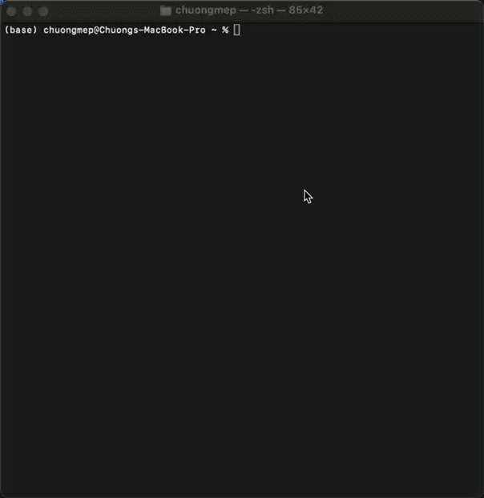
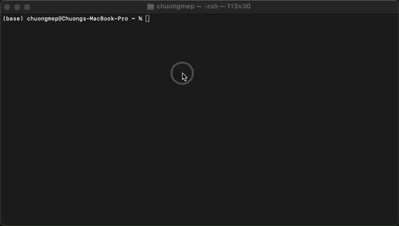
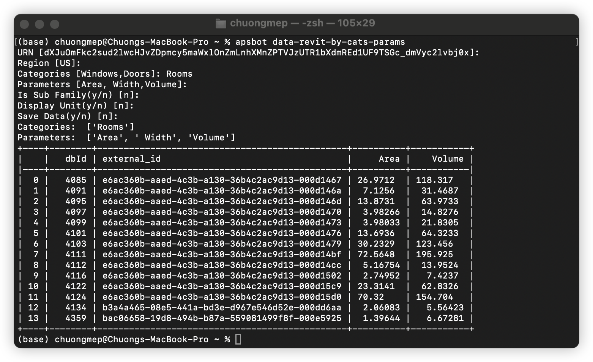

# APSBot: Autodesk Platform Services CLI

Welcome to the CLI tool `apsbot`, designed to interact seamlessly with the Autodesk Platform Services (formerly Autodesk Forge) API. This tool provides a command-line interface to access and manage data across various Autodesk services.


## Features

- Interactive with data by Command Line Interface(CLI)
- Snooping Data Around Autodesk Services (Hubs, Projects, Items, Versions, Folders, Buckets, etc.)
- Analyzing Revit Data
- Chat With AI Bot (OpenAI) to do data analysis and have fun.

## Installation

- Install [python](https://www.python.org/downloads/) version 3.9 or higher
- Install python package from [pypi](https://pypi.org/project/apsbot/) 

```bash
pip install apsbot --upgrade
```

## Requirements 

Setup environment variables

```bash
APS_CLIENT_ID = "your_client_id"
APS_CLIENT_SECRET = "your_client_secret"
OPENAI_API_KEY = "your_openai_api_key"
```

## Usage

- Command `apsbot` in terminal or command prompt to start :



```bash
apsbot [OPTIONS] COMMAND [ARGS]...
```

- Without setting path configuration
```bash
python -m apsbot [OPTIONS] COMMAND [ARGS]...
```

Notes : `python -m` use when your computer can't find the `apsbot` command.

Let's start with `hubs` and `projects` command to list all hubs in your account.


Chat With AI Bot (OpenAI) to do data analysis and have fun.



Revit Data Analysis Example :



... More, please explore by yourself.

## Contributing

Please read [dev.md](./docs/dev.md) for details on our code of conduct, and the process for submitting pull requests to us. I'm happy to receive your contributions.

## Disclaimer

This is project just play for fun with free time weekend. Please use it at your own risk. I am not responsible for any damage caused by this project.


## Many thanks 

I have a lot of inspiration from this topic :

- https://www.travisluong.com/how-to-build-a-command-line-interface-tool-with-python-pandas-typer-and-tabulate-for-data-analysis/
