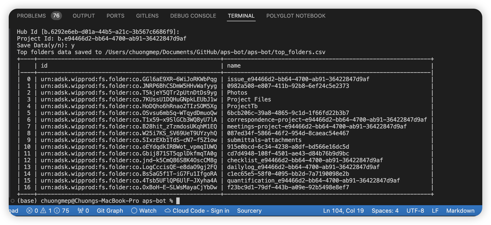

## Requirements 

Install package

From Github :

```bash
pip install git+https://github.com/chuongmep/aps-bot.git
```

Setup environment variables

```bash
APS_CLIENT_ID = "your_client_id"
APS_CLIENT_SECRET = "your_client_secret"
```

## How to use

- Start a cli to see all available commands

```bash
python -m apsbot
```
Example : 

- Get hubs list

```bash
python -m apsbot hubs
```


- Get Projects 

```bash
python -m apsbot projects
```

[](docs/projects.png)

- Get top folder 

```bash
python -m apsbot get-top-folder --hub_id <hubid> --project_id <projectid>
```



## Developer Colaboration


Build package with setuptools
```bash
python setup.py sdist bdist_wheel
```

Install package from local

```bash
pip install .\dist\callbot-0.1.0-py3-none-any.whl --user
```

## Quick Testing 

```bash
pip install --editable . --user
```


## Many thanks 

- https://www.travisluong.com/how-to-build-a-command-line-interface-tool-with-python-pandas-typer-and-tabulate-for-data-analysis/
