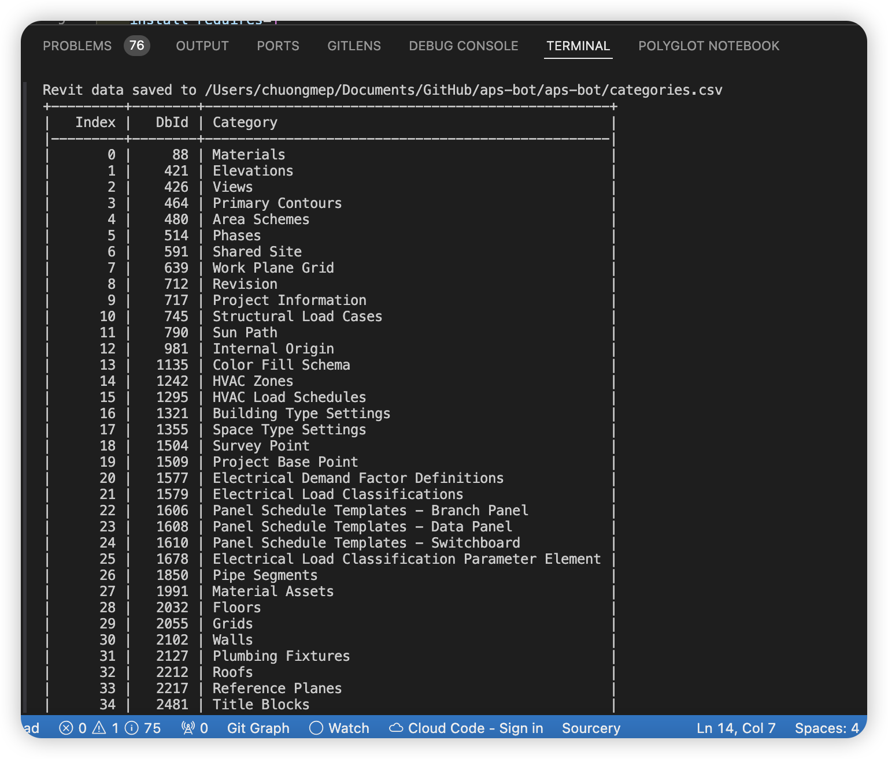

# APSBot: Autodesk Platform Services CLI

Welcome to the CLI tool `apsbot`, designed to interact seamlessly with the Autodesk Platform Services (formerly Autodesk Forge) API. This tool provides a command-line interface to access and manage data across various Autodesk services.


## Installation

- Install from package 
```bash
pip install apsbot --upgrade
```

- Install from source code

Before you can use `apsbot`, you need to install it. Clone the repository and install it using pip:

```bash
pip install git+https://github.com/chuongmep/aps-bot.git --upgrade
```

## Requirements 

Setup environment variables

```bash
APS_CLIENT_ID = "your_client_id"
APS_CLIENT_SECRET = "your_client_secret"
OPENAI_API_KEY = "your_openai_api_key"
```

## Usage
- Setting path configuration

```bash
apsbot [OPTIONS] COMMAND [ARGS]...
```

- Without setting path configuration
```bash
python -m apsbot [OPTIONS] COMMAND [ARGS]...
```
--help: Show the help message and exit.

Commands

- `auth2leg`: Authenticates using 2-legged OAuth with Autodesk services. This command handles the authentication process without user interaction and is suitable for server-to-server communication.
- `auth3leg`: Authenticates using 3-legged OAuth with Autodesk services. This command is used when user consent is required, typically for applications that need to access user-specific data.
- `data-revit-by-categories`: Read Revit data by categories. This command allows you to specify categories to filter the data that you retrieve from Revit files.
- `data-revit-by-cats-params`: Read Revit data by categories and parameters. Use this command to fetch Revit data based on both category and parameter filters, providing more granular control.
- `data-revit-categories`: Read all categories from a specified URN. This command fetches all available categories from a Revit model identified by its URN.
- `data-revit-parameters`: Read all parameters from a specified URN. Similar to the categories command but focused on retrieving all parameters associated with a Revit model.
- `hubs`: Lists all hubs associated with the Autodesk account. This command is useful for managing multiple projects or collaborations across Autodesk services.
- `item-versions`: Retrieves batch information on all item versions. This command provides historical version data for items managed within Autodesk services.
- `items`: Retrieves batch information on all items based on general information criteria. Use this command to get a broad overview of items within a project or hub.
- `login`: Logs into Autodesk services using configured credentials. Essential for initiating sessions and managing authentication states.
- `projects`: Retrieves batch information on all projects. This command offers insights into all projects managed under the user's Autodesk account.
- `refresh-token`: Refreshes the OAuth access token used for authentication. Vital for maintaining access without requiring a full re-authentication process.
- `set-folder`: Sets the default folder for operations that require a folder context. This simplifies subsequent commands by using the set folder as a context.
- `show-ports`: Displays all network ports currently in use on the system. Useful for troubleshooting network issues or conflicts within the application environment.
- `top-folders`: Retrieves batch information on all top folders in a project. Helps in navigating the project's directory structure and managing data more effectively.

... and more!


## Examples

### Authenticate using 2-legged OAuth
python -m apsbot auth2leg

### Retrieve Revit data by categories
python -m apsbot data-revit-by-categories --urn "your_urn_here"

### List all projects
python -m apsbot projects


- Start a cli to see all available commands

```bash
python -m apsbot
```
Example : 

### Get hubs list

```bash
python -m apsbot hubs
```


### Get Projects 

```bash
python -m apsbot projects
```


### Get top folder 

```bash
python -m apsbot get-top-folder --hub_id <hubid> --project_id <projectid>
```


### item-versions 


### Revit Categories



### Revit Categories-Parameters


### Bucket List


### Chat with bot


## Developer Collaboration


Build package with setuptools
```bash
python setup.py sdist bdist_wheel
```

Update new version package 

```bash
python setup.py sdist bdist_wheel
python -m twine check dist/*
python -m twine upload dist/*
```

## Quick Testing 

```bash
pip install --editable . --user
```

## Disclaimer

This is project just play for fun with free time weekend. Please use it at your own risk. I am not responsible for any damage caused by this project.


## Many thanks 

- https://www.travisluong.com/how-to-build-a-command-line-interface-tool-with-python-pandas-typer-and-tabulate-for-data-analysis/
